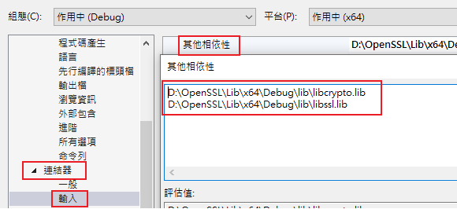

# OpenSSL 3.0 in C/C++ on Windows
## Download
* [Visual Studio](https://visualstudio.microsoft.com/zh-hant/downloads/)
  * Make sure you have ```x64 Native Tools Command Prompt for VS 2022``` and ```x86 Native Tools Command Prompt for VS 2022```<br>
    
  * You can get them by downloading [Build Tools for Visual Studio 2022](https://aka.ms/vs/17/release/vs_BuildTools.exe)
* [Strawberry Perl](https://strawberryperl.com/)
* [NASM](https://nasm.us/)
* [OpenSSL](https://github.com/openssl/openssl)

The defalut installation options for ```Strawberry Perl``` and ```NASM``` is sufficient. After installing ```Strawberry Perl``` and ```NASM```, make sure to add them to the environment path<br>

## Build OpenSSL
### Legacy provider
> The OpenSSL legacy provider supplies OpenSSL implementations of algorithms that have been deemed legacy. Such algorithms have commonly fallen out of use, have been deemed insecure by the cryptography community, or something similar.
* Operations and algorithms supplied by legacy provider
  * Hash
    * MD2
    * MD4
    * MDC2
    * WHIRLPOOL
    * RIPEMD160
  * Symmetric Ciphers
    * Blowfish
    * CAST
    * DES
    * IDEA
    * RC2
    * RC4
    * RC5
    * SEED
  * Key Derivation Function
    * PBKDF1
    * PVKKDF
* Configuration to enable legacy provider
  * File path
    * ```openssl-master\apps\openssl.cnf``` (For linux)
    * ```openssl-master\apps\openssl-vms.cnf``` (For windows)
    * ```openssl-master``` is the directory download from Openssl github
  * File content
    ```cnf
    openssl_conf = openssl_init
   
    [openssl_init]
    providers = provider_sect
   
    [provider_sect]
    default = default_sect
    legacy = legacy_sect
   
    [default_sect]
    activate = 1
   
    [legacy_sect]
    activate = 1
    ```
    * This is a minimal config file example to load and activate both the legacy and the default provider in the default library context.
  * Load default and legacy provider programmatically
    ```c
    OSSL_PROVIDER* legacy;
    OSSL_PROVIDER* deflt;
    legacy = OSSL_PROVIDER_load(NULL, "legacy");
    deflt = OSSL_PROVIDER_load(NULL, "default");
    ```
### Build commands
* Create new directories to store the output built by openssl
  ```
  OpenSSL
   ├─DLL
   │  ├─x32
   │  │  ├─Debug
   │  │  └─Release
   │  └─x64
   │      ├─Debug
   │      └─Release
   ├─Lib
   │  ├─x32
   │  │  ├─Debug
   │  │  └─Release
   │  └─x64
   │      ├─Debug
   │      └─Release
   └─SSL
  ``` 
* x64 Native Tools Command Prompt for VS 2022
  ```sh
  nmake clean
  perl Configure VC-WIN64A --debug --prefix=[Path\To\OpenSSL]\DLL\x64\Debug --openssldir=[Path\To\OpenSSL]\SSL
  nmake test
  nmake install_sw

  nmake clean
  perl Configure VC-WIN64A --prefix=[Path\To\OpenSSL]\DLL\x64\Release --openssldir=[Path\To\OpenSSL]\SSL
  nmake test
  nmake install_sw

  nmake clean
  perl Configure VC-WIN64A --debug --prefix=[Path\To\OpenSSL]\Lib\x64\Debug --openssldir=[Path\To\OpenSSL]\SSL no-shared
  nmake test
  nmake install_sw

  nmake clean
  perl Configure VC-WIN64A --prefix=[Path\To\OpenSSL]\Lib\x64\Release --openssldir=[Path\To\OpenSSL]\SSL no-shared
  nmake test
  nmake install_sw
  ```
  * These commands should run under ```[Path\To\openssl-master]``` path in ```x64 Native Tools Command Prompt for VS 2022```
* x86 Native Tools Command Prompt for VS 2022
  ```sh
  nmake clean
  perl Configure VC-WIN64A --debug --prefix=[Path\To\OpenSSL]\DLL\x32\Debug --openssldir=[Path\To\OpenSSL]\SSL
  nmake test
  nmake install_sw

  nmake clean
  perl Configure VC-WIN64A --prefix=[Path\To\OpenSSL]\DLL\x32\Release --openssldir=[Path\To\OpenSSL]\SSL
  nmake test
  nmake install_sw

  nmake clean
  perl Configure VC-WIN64A --debug --prefix=[Path\To\OpenSSL]\Lib\x32\Debug --openssldir=[Path\To\OpenSSL]\SSL no-shared
  nmake test
  nmake install_sw

  nmake clean
  perl Configure VC-WIN64A --prefix=[Path\To\OpenSSL]\Lib\x32\Release --openssldir=[Path\To\OpenSSL]\SSL no-shared
  nmake test
  nmake install_sw
  ```
## Include OpenSSL libraries in Visual Studio
### Project configure

* ```[專案] -> [屬性] -> [C/C++] -> [一般] -> [其他Include目錄] -> [Add path to include folder according to Debug/Release and Win32/x64]```


* ```[專案] -> [屬性] -> [C/C++] -> [前置處理器] -> [前置處理器定義] -> [_CRT_SECURE_NO_WARNINGS]```
* This setting is optional and can disable errors when using functions such as ```fopen```, ```strncpy```, etc.


* ```[專案] -> [屬性] -> [連結器] -> [輸入] -> [其他相依性] -> [Add path to libcrypto.lib and libssl.lib according to Debug/Release and Win32/x64]```

### Headers
```c
// Common header files
#include <openssl/conf.h>
#include <openssl/evp.h>
#include <openssl/err.h>
#include <openssl/rand.h>
```
We also need ```Crypt32.lib``` and ```Ws2_32.lib``` from microsoft system libraries
```c
#pragma comment(lib, "crypt32")
#pragma comment(lib, "ws2_32.lib")
```

## Example
I've included some common cryptography algorithm examples using openssl libraries' high level API. Check out [symmetric cipher template](./template.cpp) to write your own symmetric cryptography program with minor modification. Moreover, I've included the exmaple using ```RSA``` as an example of asymetric cipher.

## Credits
* I've learned most of the setups from [TroubleChute](https://www.youtube.com/channel/UCkih2oVTbXPEpVwE-U7kmHw)'s tutorial video, including the scripts for automatically built

## References
* [TroubleChute - Build & Use OpenSSL with Visual Studio](https://www.youtube.com/watch?v=PMHEoBkxYaQ)
* [OpenSSL 3.0 Provider](https://wiki.openssl.org/index.php/OpenSSL_3.0#Providers)
* [How to include Crypt32.lib and Ws2_32.lib](https://github.com/openssl/openssl/issues/6635)
* [Encrypting/Decrypting a file using OpenSSL EVP](https://medium.com/@amit.kulkarni/encrypting-decrypting-a-file-using-openssl-evp-b26e0e4d28d4)
* [Default OpenSSL 3.0 RSA encryption implementation](https://www.openssl.org/docs/man3.0/man3/EVP_PKEY_encrypt_init_ex.html)
* [Default OpenSSL 3.0 RSA decryption implementation](https://www.openssl.org/docs/man3.0/man3/EVP_PKEY_decrypt.html)